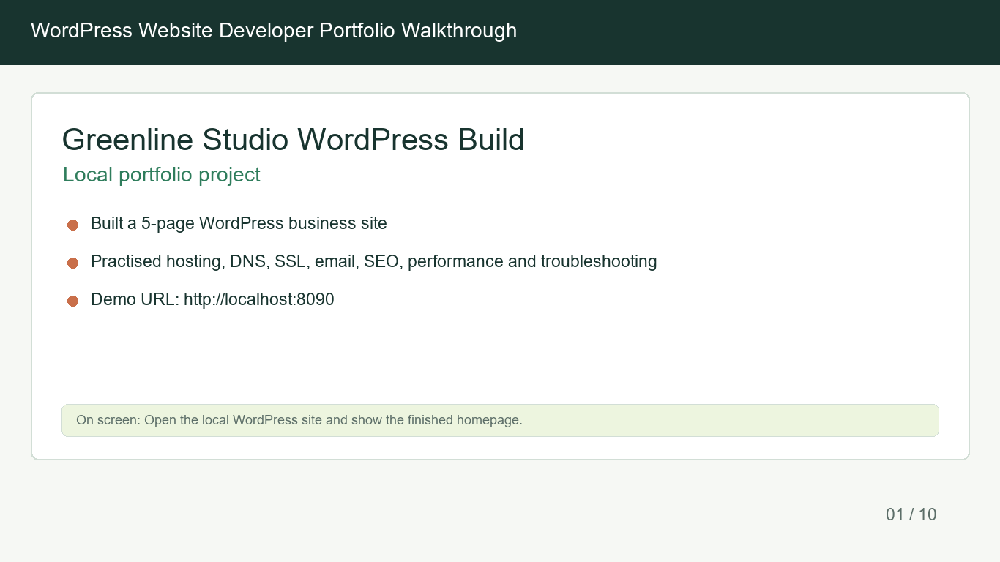
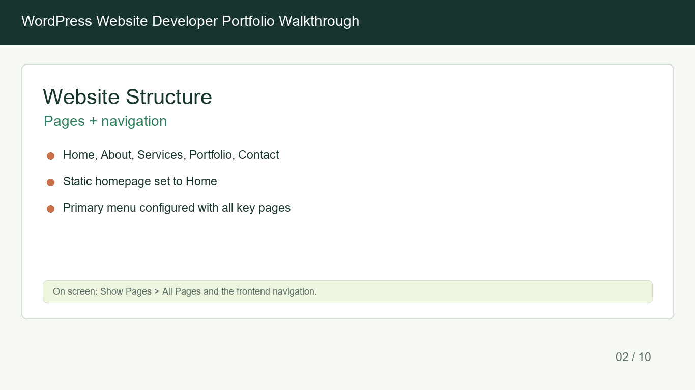
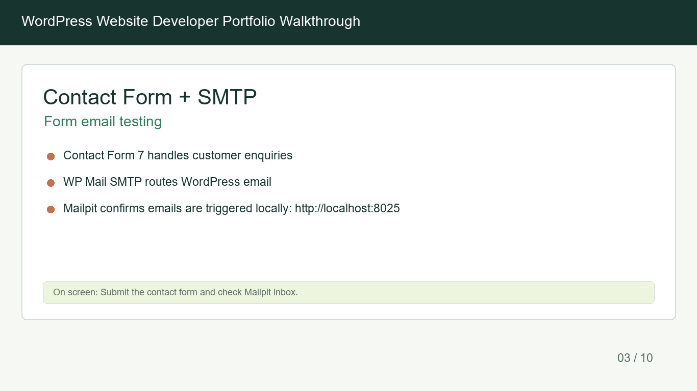
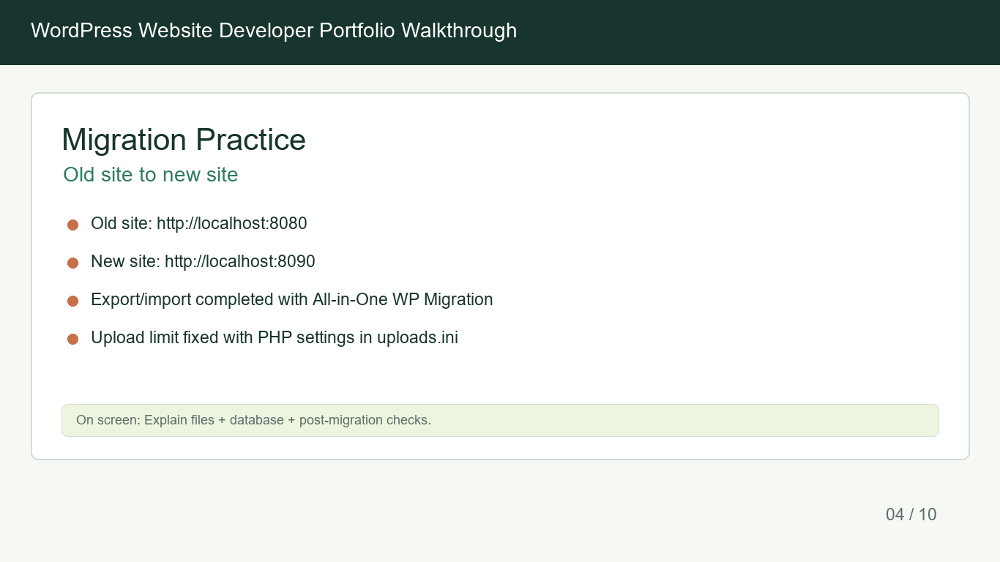
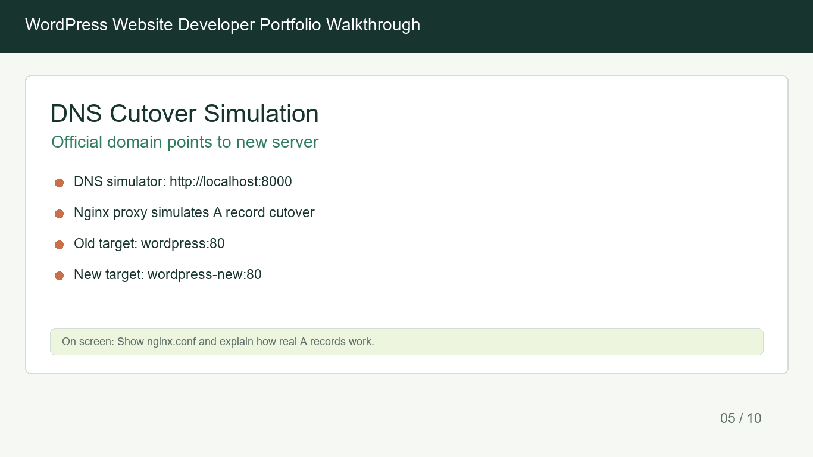
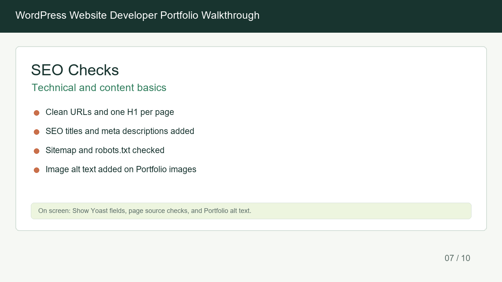
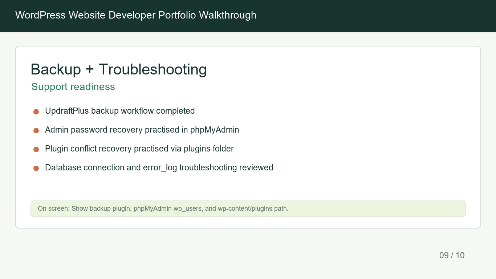
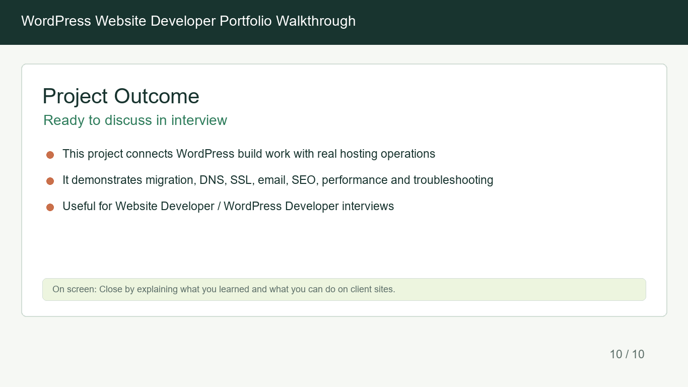

# Greenline Studio WordPress Delivery Project

A local WordPress portfolio project demonstrating practical website delivery skills for small business and agency-style work.

This project was built to show more than page editing. It demonstrates how a WordPress website connects with hosting, migration, DNS, SSL, email, forms, SEO, analytics, QA, troubleshooting, documentation, and client handover.

## Highlights

Custom WordPress plugin | REST API endpoint | Docker local environment | DNS cutover simulation | Email testing | GA4/GTM tracking concepts | WooCommerce readiness | Client handover workflow

## Project Overview

Greenline Studio is a local demo website created as a realistic WordPress delivery project. It simulates the kind of work involved in building, testing, maintaining, and handing over a small business website.

The project includes:

- A finished WordPress demo site
- A case study page explaining the delivery workflow
- A custom WordPress plugin called `Greenline Site Toolkit`
- A local Docker environment with WordPress, MySQL, phpMyAdmin, Mailpit, and an Nginx DNS cutover simulator
- Documentation for setup, troubleshooting, client training, analytics, and handover

## What I Did

- Built and maintained a WordPress demo website for a small business-style project.
- Practised an old-site to new-site migration workflow.
- Simulated DNS cutover from an old site to a new site using Nginx.
- Tested WordPress contact form email delivery using Mailpit.
- Reviewed cPanel-style hosting concepts including DNS, SSL, email, databases, phpMyAdmin, and upload limits.
- Added SEO, image alt text, performance, backup, and troubleshooting notes.
- Built a custom WordPress plugin with admin settings, shortcodes, a portfolio custom post type, REST API output, frontend JavaScript rendering, Google Tag Manager support, enquiry tracking, website audit sections, WooCommerce readiness, and client handover components.
- Created client-facing documentation to explain setup, maintenance, analytics, and handover clearly.

## Technologies Used

- WordPress
- PHP
- JavaScript
- HTML
- CSS
- Docker
- MySQL
- phpMyAdmin
- Nginx
- Mailpit
- Contact Form 7
- WooCommerce awareness
- WordPress REST API
- Google Tag Manager
- GA4 event-tracking concepts
- cPanel-style hosting, DNS, SSL, and email workflows

## Custom Plugin: Greenline Site Toolkit

The original styling plugin was upgraded into `Greenline Site Toolkit`, a small custom WordPress plugin designed to demonstrate practical WordPress development skills.

The plugin includes:

- Admin settings page for editable business information
- CTA shortcode
- Business hours shortcode
- Portfolio custom post type
- Custom REST API endpoint
- API-powered portfolio grid
- WooCommerce active check
- Google Tag Manager container support
- Contact form lead tracking
- Phone, email, and CTA click tracking
- Tracking summary block
- Website audit summary
- WooCommerce readiness checklist
- Client handover checklist

Step-by-step improvements are documented in:

```text
RELEASE_NOTES.md
```

## Visual Walkthrough


### Website Build And Structure





### Forms, Migration, And DNS







### QA And Handover Thinking







## Local Demo URLs

Run the environment first, then open:

```text
Finished site:        http://localhost:8090
Case study:           http://localhost:8090/case-study/
Old site:             http://localhost:8080
DNS simulator:        http://localhost:8000
Mailpit inbox:        http://localhost:8025
phpMyAdmin old DB:    http://localhost:8081
phpMyAdmin new DB:    http://localhost:8082
```

## Run Locally

```powershell
git clone https://github.com/kate666kate/greenline-wordpress-delivery-project.git
cd greenline-wordpress-delivery-project
Copy-Item .env.example .env
docker compose up -d
```

Then open:

```text
http://localhost:8090/case-study/
```

## Key Files

- `docker-compose.yml`: WordPress, MySQL, phpMyAdmin, Mailpit, and Nginx DNS simulator services.
- `nginx.conf`: simulated DNS cutover between old and migrated WordPress sites.
- `uploads.ini`: PHP upload and memory limits used during migration practice.
- `greenline-site-style/`: custom WordPress toolkit plugin and styling used by the project.
- `wordpress-website-developer-portfolio/`: project notes, workflow checklists, demo script, and skill files.
- `wordpress-website-developer-portfolio/walkthrough-frames/`: visual project walkthrough frames.
- `CLIENT_TRAINING_GUIDE.md`: client-facing guide for toolkit settings, portfolio projects, shortcodes, maintenance checks, and handover training.
- `GA_GTM_SETUP_NOTES.md`: GA4 and Google Tag Manager setup notes for tracking, form events, WooCommerce awareness, testing, and privacy.
- `ga-gtm-tracking-demo.html`: local visual demo showing how website actions can push events to a simulated GTM `dataLayer`.

## Security Note

This repository uses local-only demo credentials through `.env.example`. Do not commit real cPanel, WordPress, SMTP, API, database, analytics, or client credentials.
